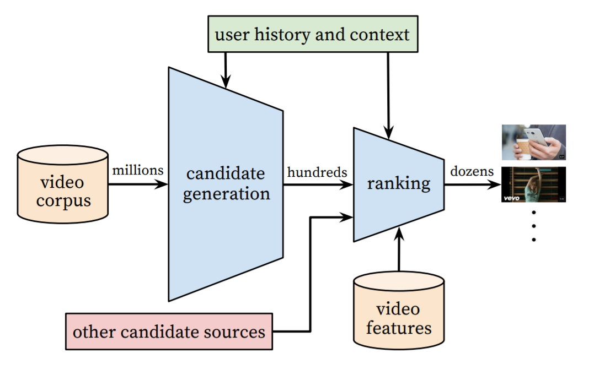

수정중

2016년 구글 리서치가 공개한 논문이다. 이 논문에서는 YouTube라는 영상 플랫폼의 특징을 고려한 추천시스템을 설명하고 있다.

[논문 링크](http://research.google.com/pubs/pub45530.html?utm_content=bufferf6bbc&utm_medium=social&utm_source=twitter.com&utm_campaign=buffer)

# ABSTRACT
1. deep candidate generation model
2. separate deep ranking model

**#추천시스템; #딥러닝; #확장성**

# 1. INTRODUCTION

Youtube 추천시스템은 세가지 관점을 고려해서 만들었다.

1. 규모(Scale) : 작은 규모에서 작동했던 추천 알고리즘은 유투브에 적용하면 작동하지 않았다. 유투브에 특화된 알고리즘이 필요할 뿐만 아니라 효율적인 서버 시스템이 필요하다.
2. 새로움(Freshness) : 유투브는 끊임없이 동영상이 업로드 되기 때문에 후보군(코퍼스)이 일정하지 않다.
3. 잡음(Noise) : 사용자가 시청한 동영상은 전체 동영상의 극히 일부(sparsity)이고, 사용자가 시청한 동영상을 마음에 들어하는지 정확한 피드백이 없다.

이전 연구들은 대부분 matrix-factorization을 사용하고 딥러닝을 이용한 연구는 상대적으로 적었다. 

# 2. SYSTEM OVERVIEW

  

위 그림이 추천시스템의 전체적인 구성이고, 파란색 블럭이 실제 추천을 진행하는 단계이다.

1. video corpus
    
    영상 코퍼스는 사용자에게 추천해줄 영상의 후보를 의미한다. 

2. 후보 생성 네트워크 (The candidate generation network)

    - 협동 필터링(collaborative filtering)으로 넓은 의미의 개인화를 제공한다.    
    - 사용자 간의 유사성은 coarse features 관점에서 표현된다. 여기서 말하는 coarse features는 비디오 시청한 ID, 검색 쿼리 토큰, 인구통계정보를 의미한다.
    
3. 랭킹 네트워크 (The ranking network)
    
    - 상대적인 중요도를 구분하여 세밀한 추천 목록 생성한다. 
    - 여기에는 재현율(recall, 실제 True 중 True로 예측한 비율)이 사용된다. 
    
이 과정에서 사용자의 시청기록과 맥락을 고려한다.

  
  
모델 성능은 두가지 방법으로 측정한다. 
  1. Offline Experiments : precision, recall, ranking loss
  2. Live Experiments : 클릭률, 시청시간   

두 실험의 결과가 항상 똑같진 않다. 1번 방법의 메트릭으로 나타나지 않는 실제 결과를 A/B 테스트를 통해 알아보고자 2번째 방법을 병행한다.

# 3. CANDIDATE GENERATION

## 3.1 Recommendation as Classification

극단적인 다중 분류를 하여 추천한다. 

$$
K(a,b) = \int \mathcal{D}x(t) \exp(2\pi i S[x]/\hbar)
$$

### *Efficient Extreme Multiclass*

실제 레이블과 샘플링 된 네거티브 클래스에 대해 교차 엔트로피 손실이 최소화 된다.

사용자에게 보여줄 top N개를 뽑는다. 수백만개의 항목들

## 3.2 Model Architecture

  

각 영상마다 고정된 단어로 *고차원 임베딩*을 학습시키고 이 임베딩을 *피드포워드 신경망*에 넣는다. 사용자의 시청 기록은 sparse한 영상 ID에 대한 가변길이 시퀀스로 나타낸다. 이 시퀀스는 임베딩으로 된 dense 벡터 표현으로 매핑된 것이다. 
네트워크는 고정길이 dense를 입력이 필요하고 여러 방법(합, 구성요소별 최대 등) 중에서 가장 잘 수행 된 임베딩의 평균을 구한다. 
피처들은 첫번째 레이어에 연ㄱ
